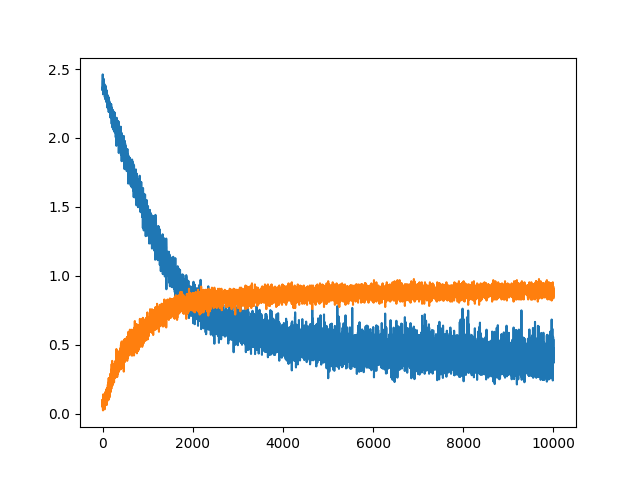

# SUCCOTASH

The goal of this is to implement basic neural network architectures with a focus on...
  1. the math behind machine learning
  2. fast training on a CPU

#### File Structure
```
ffnn.py        -> the neural network
train.py       -> a file to train and test the network
test.py        -> small basic tests that the network functions as expected
activations.py -> nonlinear activation functions
loss_fcns.py   -> Loss/Error/Cost functions
```



shape of input = (batch size, l1)
shape of l1    = (l1, l2)
shape of l2    = (l2, l3)
...
shape of out   = (l(-1), out)


