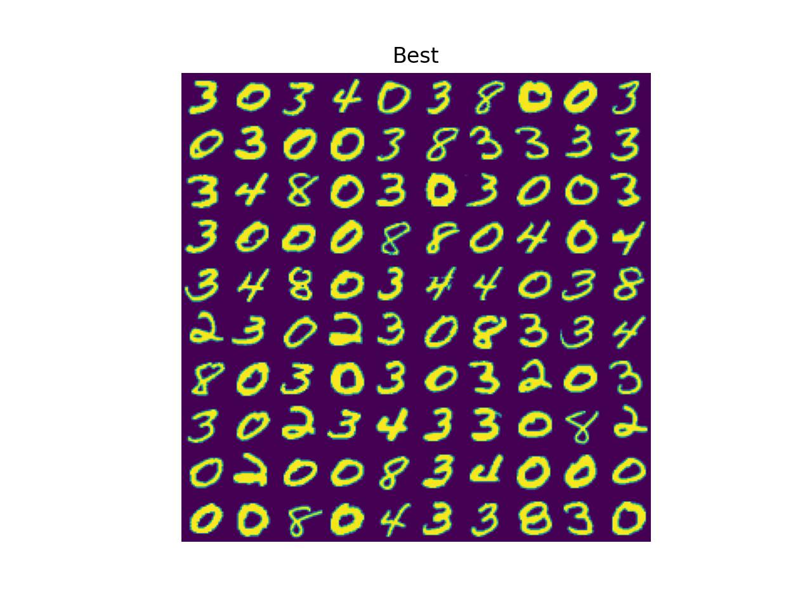
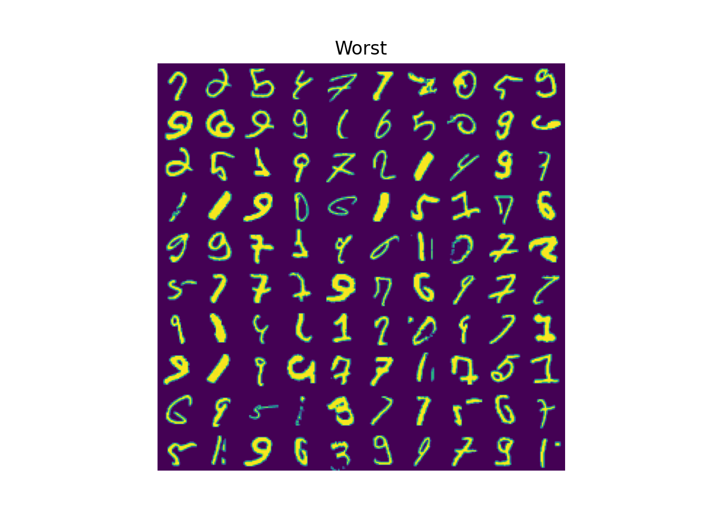

# SUCCOTASH

97.2% accuracy on MNIST Test set (with the weights and biases in `good_models`).
Try `./test.py` to see examples of the network's predictions

#### File Structure
```
ffnn.py        -> the neural network
train.py       -> a file to train and test the network
test.py        -> small basic tests that the network functions as expected
activations.py -> nonlinear activation functions
loss_fcns.py   -> Loss/Error/Cost functions
```

Here the the best numbers from the test set (by lowest lost)


And here are the worst numbers from the test set (by greatest lost)


And here are the parameters from the training session
```
test accuracy 0.972
test loss 0.094
[784, 256, 10] [leaky_ReLU, softmax] cross_entropy_loss
batch size 128
learning rate 1
alpha 0.05
```
